# GymFlow AI

GymFlow AI – full-stack система для прогнозування завантаженості спортивних залів, персоналізованого планування тренувань, прогнозування наступного тренувального навантаження та підтримки користувача через AI Coach з retrieval-контекстом.

Тема бакалаврської роботи: **«Побудова прогнозної моделі машинного навчання для персоналізованого тренувального процесу»**.

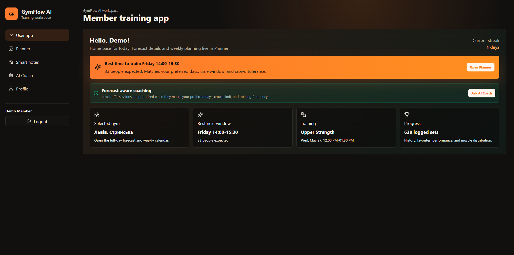

---

## Автор

| Поле | Значення |
|---|---|
| Студент | Попик Богдан |
| Група | ФЕІ-42 |
| Спеціальність | F3 «Комп’ютерні науки» |
| Науковий керівник | доц. Демків Л. С. |
| Рік виконання | 2026 |

---

## Загальна інформація

| Поле | Значення |
|---|---|
| Тип проєкту | Full-stack вебзастосунок з ML-компонентами |
| Backend | Python, FastAPI, SQLAlchemy |
| Frontend | React, Vite, TypeScript |
| База даних | SQLite для локального запуску, PostgreSQL для Docker Compose |
| ML | scikit-learn, PyTorch, statsmodels |
| AI/RAG | BM25-style retrieval, Gemini provider, Vertex AI tuning branch |
| Інфраструктура | Docker Compose, Makefile, Prometheus, Grafana |
| Дані | `data/raw/occupancy_observations_2026.csv`, synthetic extension, demo workout history |

Проєкт поєднує дослідницький ML-контур і прикладну систему. ML-частина відповідає за підготовку даних, навчання моделей, порівняння результатів, feature ablation, RAG evaluation та model registry. Прикладна частина демонструє, як ці результати інтегруються в реальний користувацький сценарій: прогноз залу, планування тренування, ведення історії, рекомендація наступного підходу та пояснювані відповіді AI Coach.

---

## Опис функціоналу

### Для користувача

- перегляд прогнозу завантаженості залу;
- вибір менш завантажених часових слотів для тренування;
- планування тренувань у календарі;
- запуск активного тренування;
- логування вправ, підходів, ваги й повторень;
- отримання next-set рекомендації для наступного підходу;
- перегляд історії, прогресу, статистики й досягнень;
- робота з бібліотекою вправ;
- спілкування з AI Coach, який використовує retrieval-контекст і може виконувати структуровані дії.

### Для менеджера залу

- перегляд завантаженості локацій;
- аналіз прогнозів за мережею та окремим залом;
- порівняння локацій;
- перегляд research-метрик;
- формування off-peak promotion сценаріїв;
- підготовка чернеток повідомлень для користувачів.

### Для дослідницької частини

- підготовка raw/processed/synthetic даних;
- побудова baseline-моделей;
- навчання табличних моделей прогнозування;
- запуск sequence-моделей;
- feature ablation;
- оцінювання next-set progression;
- оцінювання RAG retrieval;
- формування model registry;
- підготовка Model Card, Dataset Card, Synthetic Data Card та ADR.

---

## Основний flow системи

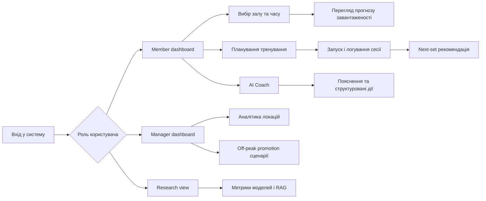

---

## Архітектура

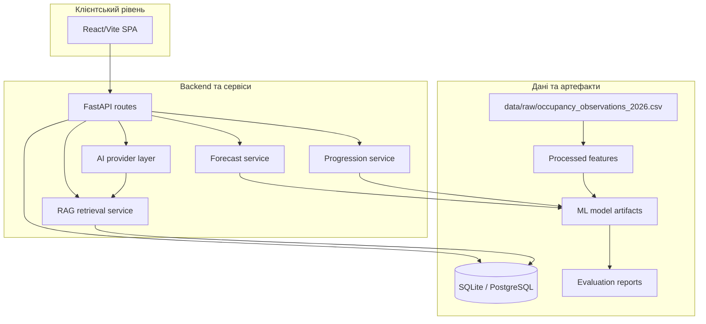

---

## ML-контур

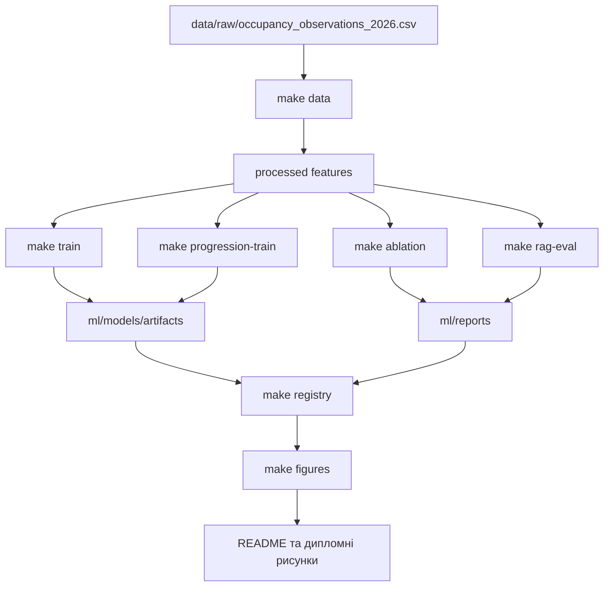

---

## Основні результати експериментів

### Прогнозування завантаженості

| Модель | MAE | RMSE | WAPE | Роль |
|---|---:|---:|---:|---|
| `hgb_calendar_lag` | 6.3751 | 9.4323 | 0.1452 | Найкращий ряд model registry |
| `hist_gradient_boosting` | 6.5723 | 9.7546 | 0.1497 | Production-модель |
| `transformer_sequence_torch` | 7.5006 | 11.2579 | 0.1720 | Sequence-експеримент |
| `previous_observation` | 8.3206 | 13.5099 | 0.1896 | Baseline |

Production-модель `hist_gradient_boosting` зменшила MAE порівняно з `previous_observation` baseline на 21.01 %.

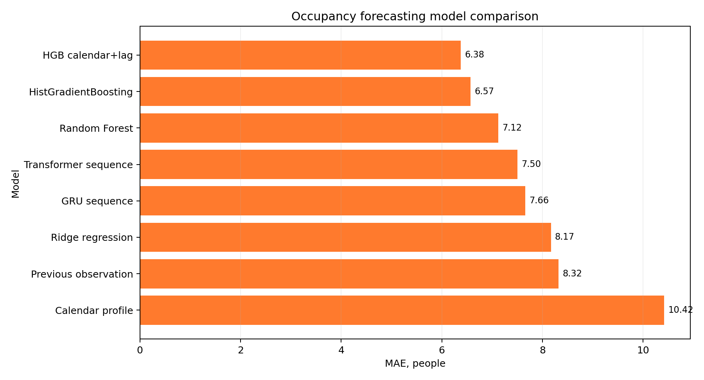

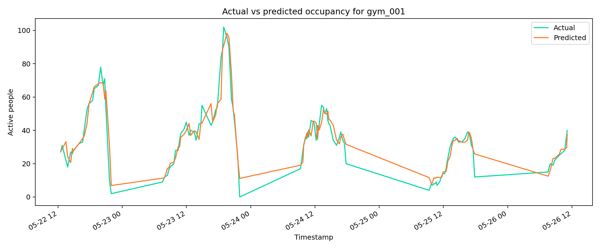

### Feature ablation

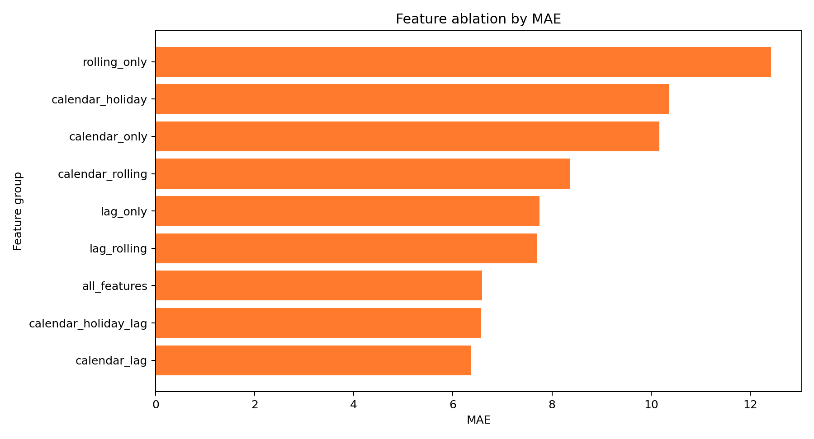

### Next-set progression

| Модель | MAE ваги, кг | RMSE ваги, кг | Роль |
|---|---:|---:|---|
| `hybrid_ridge_weight_policy_reps` | 5.997 | 13.752 | Основна модель |
| `policy_baseline` | 6.999 | 14.247 | Базова policy-логіка |

Модель `hybrid_ridge_weight_policy_reps` зменшила MAE порівняно з `policy_baseline` на 14.32 %.

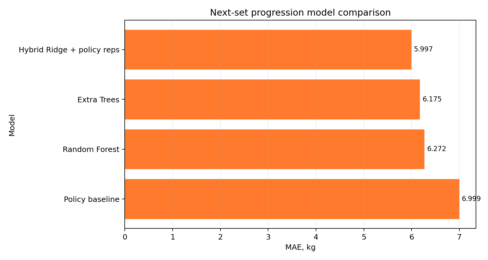

### RAG evaluation

| Метрика | Значення |
|---|---:|
| Кількість запитів | 6 |
| Hit@1 | 0.8333 |
| Hit@3 | 1.0000 |
| Hit@6 | 1.0000 |
| MRR | 0.9167 |

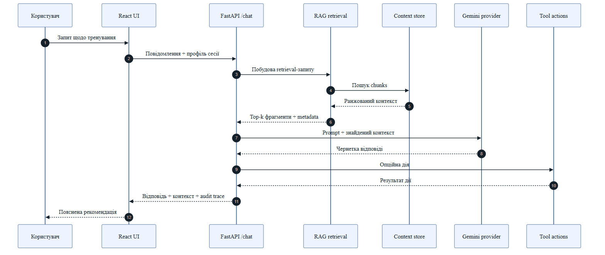

### Vertex AI tuning

Supervised tuning Gemini у Vertex AI завершився успішно, але smoke evaluation не показав переваги tuned endpoint над base Gemini + RAG.

| Варіант | Mean keyword score |
|---|---:|
| base Gemini + RAG | 0.736 |
| tuned endpoint | 0.639 |

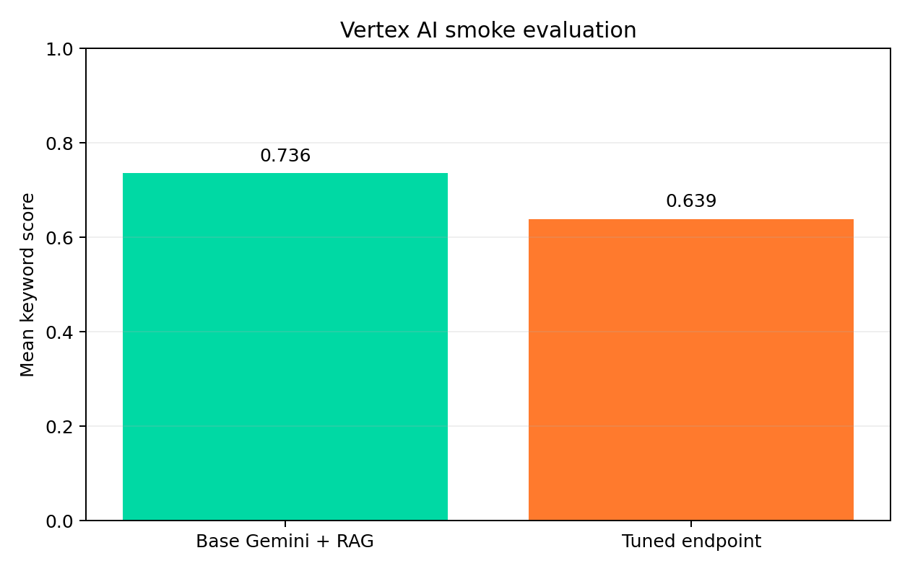

### Узагальнення результатів

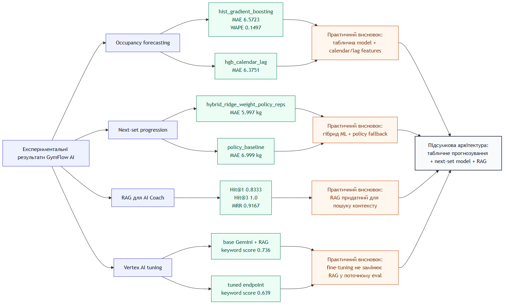

---

## Демонстрація інтерфейсу

| Member overview | Planner | AI Coach |
|---|---|---|
|  | 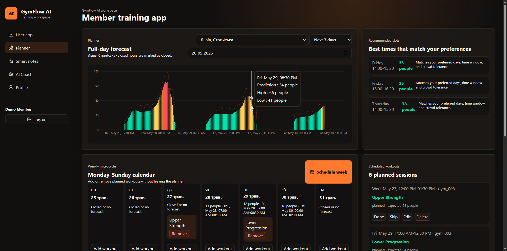 | 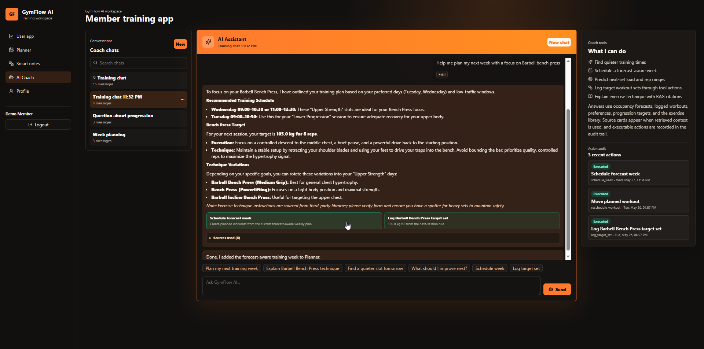 |

| Workout logging | Exercise library | Research view |
|---|---|---|
| 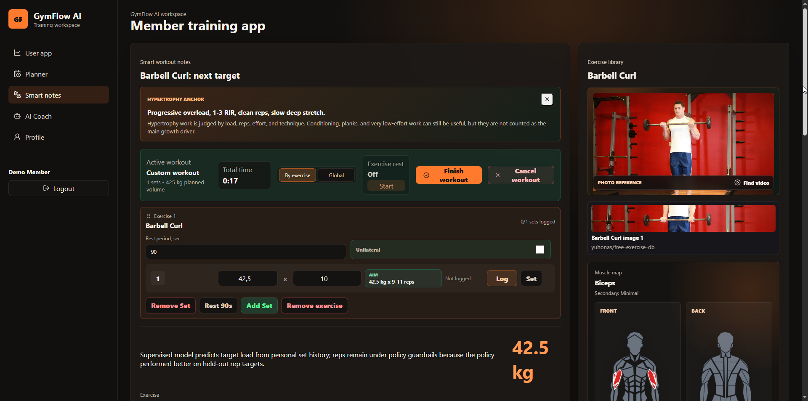 | 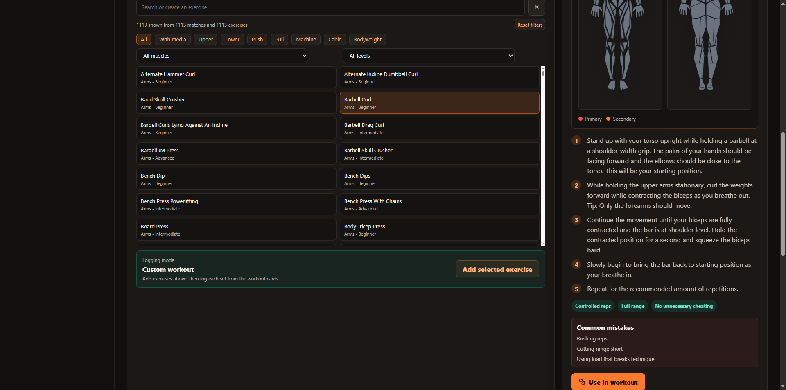 | 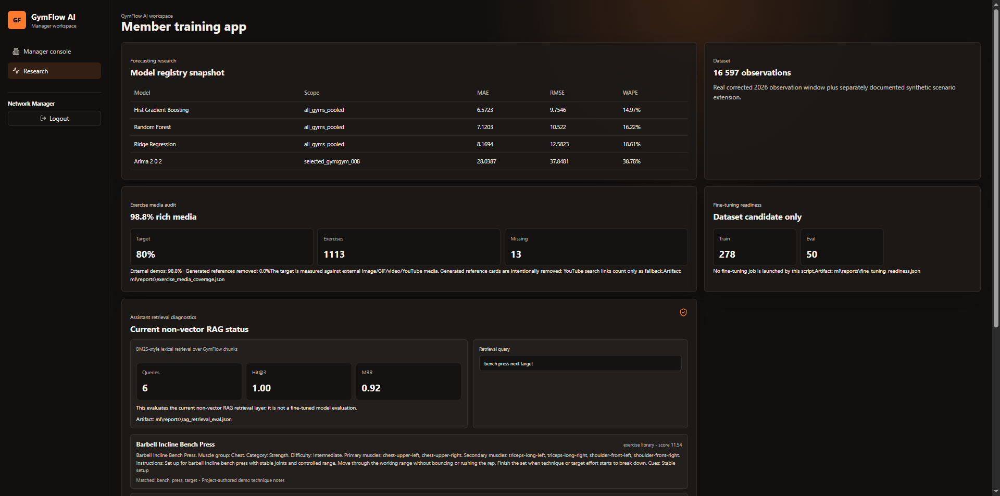 |

---

## Опис основних класів і файлів

### Backend

| Файл | Призначення |
|---|---|
| `apps/api/app/main.py` | Точка входу FastAPI |
| `apps/api/app/routes.py` | HTTP endpoint-и |
| `apps/api/app/models.py` | SQLAlchemy-моделі бази даних |
| `apps/api/app/schemas.py` | Pydantic-схеми запитів і відповідей |
| `apps/api/app/services/forecast_data.py` | Сервіс прогнозних даних |
| `apps/api/app/services/progression.py` | Сервіс next-set progression |
| `apps/api/app/services/rag_retrieval.py` | Retrieval-компонент AI Coach |
| `apps/api/app/ai_provider.py` | Provider-рівень для AI Coach |

### Frontend

| Файл | Призначення |
|---|---|
| `apps/web/src/pages/OverviewPage.tsx` | Огляд прогнозів і стану користувача |
| `apps/web/src/pages/PlannerPage.tsx` | Планування тренувань |
| `apps/web/src/pages/WorkoutsPage.tsx` | Логування тренувань, вправи, next-set |
| `apps/web/src/pages/CoachPage.tsx` | Інтерфейс AI Coach |
| `apps/web/src/pages/ProfilePage.tsx` | Профіль, прогрес, статистика |
| `apps/web/src/pages/ManagerPage.tsx` | Менеджерська аналітика |
| `apps/web/src/pages/ResearchPage.tsx` | Research-метрики та model registry |
| `apps/web/src/lib/api.ts` | Frontend API client |

### Дослідницькі скрипти

| Файл | Призначення |
|---|---|
| `scripts/prepare_data.py` | Підготовка raw observations і feature engineering |
| `scripts/generate_synthetic_occupancy.py` | Побудова synthetic occupancy extension |
| `scripts/run_ml_experiments.py` | Навчання табличних моделей |
| `scripts/run_feature_ablation.py` | Feature ablation |
| `scripts/run_deep_forecasting_experiments.py` | Sequence-моделі |
| `scripts/train_progression_model.py` | Навчання next-set progression |
| `scripts/evaluate_rag_retrieval.py` | Оцінювання RAG retrieval |
| `scripts/build_model_registry.py` | Формування model registry |
| `scripts/doctor.py` | Перевірка середовища й ключових файлів |

---

## Як запустити проєкт з нуля

### 1. Клонування репозиторію

```bash
git clone <repository-url>
cd gymflow-ai
```

### 2. Створення Python-середовища

```powershell
py -3.11 -m venv .venv
.\.venv\Scripts\python.exe -m pip install -r requirements.txt
```

### 3. Встановлення frontend-залежностей

```powershell
cd apps\web
npm install
cd ..\..
```

### 4. Перевірка середовища

```powershell
make doctor
```

### 5. Підготовка даних і моделей

```powershell
make data
make synthetic
make train
make progression-train
make rag-eval
make registry
```

### 6. Запуск backend

```powershell
make api
```

### 7. Запуск frontend

```powershell
make web
```

Локальні адреси:

| Сервіс | URL |
|---|---|
| Frontend | `http://127.0.0.1:5173` |
| API docs | `http://127.0.0.1:8000/docs` |
| API metrics | `http://127.0.0.1:8000/metrics` |

### 8. Docker Compose

```powershell
make docker-config
make docker-up-d
make docker-smoke
```

---

## Demo-акаунти

| Роль | Email | Пароль |
|---|---|---|
| Member | `member@gymflow.ai` | `demo` |
| Manager | `manager@gymflow.ai` | `manager` |

---

## API приклади

### Перевірка стану API

**GET `/health`**

Очікувана відповідь:

```json
{
  "status": "ok"
}
```

### Вхід користувача

**POST `/auth/login`**

```json
{
  "email": "member@gymflow.ai",
  "password": "demo"
}
```

### Отримання next-set рекомендації

**GET `/users/{user_id}/next-session`**

Повертає структуровану рекомендацію для наступного підходу: вагу, повторення, діапазон повторень, стратегію та пояснення.

### AI Coach

**POST `/chat`**

```json
{
  "message": "Help me plan a quieter workout slot and suggest my next bench press set."
}
```

### RAG diagnostics

**GET `/rag/search`**

Повертає ранжовані retrieval chunks, score, matched terms і metadata джерел.

---

## Інструкція для користувача

1. Увійти через demo-акаунт `member@gymflow.ai`.
2. На сторінці Overview переглянути рекомендований час і коротку статистику.
3. У Planner вибрати дату, горизонт прогнозу та запланувати тренування.
4. У Workouts запустити тренування, додати вправи й залогувати підходи.
5. Переглянути next-set підказку для наступної ваги та повторень.
6. У Coach поставити питання про тренування або попросити виконати дію.
7. У Profile переглянути прогрес, історію, активність і досягнення.

Для менеджера:

1. Увійти через `manager@gymflow.ai`.
2. Відкрити Manager для перегляду завантаженості локацій.
3. Перейти в Research для перегляду model registry, ML-метрик і RAG diagnostics.

---

## Перевірка якості

```powershell
make test
make scientific-check
```

Поточні перевірені результати:

| Перевірка | Результат |
|---|---:|
| Підготовлені рядки raw/processed даних | 16597 |
| Кількість залів | 16 |
| Data preparation test | `status: ok` |
| Doctor check | `status: ok` |
| RAG queries | 6 |
| RAG Hit@3 | 1.0 |
| RAG MRR | 0.9167 |

---

## Структура репозиторію

```text
gymflow-ai/
  apps/
    api/                  FastAPI backend
    web/                  React/Vite frontend
  data/
    raw/                  канонічні raw occupancy дані за 2026 рік
    processed/            підготовлені ознаки
    synthetic/            synthetic occupancy extension
  docs/
    adr/                  Architecture Decision Records
    dataset-card/         Dataset Card
    model-card/           Model Card
    readme-assets/        скріншоти, графіки й діаграми для README
    diagrams/             C4 та pipeline-діаграми
  gymflow_core/           спільна доменна логіка
  infra/                  Prometheus і Grafana
  ml/
    fine_tuning/          Vertex AI tuning artifacts
    models/artifacts/     збережені ML-моделі
    reports/              метрики, registry, evaluation outputs
  scripts/                data, training, evaluation, validation scripts
  docker-compose.yml
  Makefile
  README.md
```

---

## Документаційні артефакти

| Артефакт | Файл |
|---|---|
| Model Card | `docs/model-card/MODEL_CARD.md` |
| Dataset Card | `docs/dataset-card/DATASET_CARD.md` |
| Synthetic Data Card | `docs/synthetic-data/SYNTHETIC_DATA_CARD.md` |
| ADR: model selection | `docs/adr/0001-forecasting-model-selection.md` |
| ADR: synthetic data scope | `docs/adr/0002-synthetic-data-scope.md` |
| ADR: weather features | `docs/adr/0003-weather-features-branch.md` |
| C4 context | `docs/diagrams/c4-context.mmd` |
| C4 container | `docs/diagrams/c4-container.mmd` |
| ER data model | `docs/diagrams/er-core-data-model.mmd` |
| Data pipeline | `docs/diagrams/data-preparation-pipeline.mmd` |
| Forecasting pipeline | `docs/diagrams/forecasting-experiment-pipeline.mmd` |
| RAG pipeline | `docs/diagrams/assistant-rag-pipeline.mmd` |

---

## Проблеми і рішення

| Проблема | Рішення |
|---|---|
| API не запускається | Виконати `make doctor`, перевірити `.env`, Python-залежності та порт `8000` |
| Frontend не відкривається | Перейти в `apps/web`, виконати `npm install`, запустити `make web` |
| Дані не підготовлені | Запустити `make data`, перевірити `data/raw/occupancy_observations_2026.csv` |
| Моделі не знайдені | Запустити `make train`, `make progression-train`, `make registry` |
| RAG diagnostics порожній | Запустити `make rag-eval` і перевірити demo data |
| Docker Compose не стартує | Виконати `make docker-config`, перевірити Docker Desktop і вільні порти |

---

## Обмеження

- Частина workout history є demo/synthetic product data, а не реальними багатомісячними логами користувача.
- Для прогнозування завантаженості використано обмежене реальне вікно спостережень і synthetic extension.
- RAG evaluation виконано на 6 тестових запитах, тому результат описує якість retrieval-рівня на контрольному наборі.
- Vertex AI tuning завершився технічно успішно, але tuned endpoint не перевищив base Gemini + RAG у smoke evaluation.
- Система є дослідницьким прототипом і не є медичним або сертифікованим тренерським інструментом.

---

## Використані джерела та документація

- FastAPI documentation: <https://fastapi.tiangolo.com/>
- React documentation: <https://react.dev/>
- Vite documentation: <https://vite.dev/>
- SQLAlchemy ORM documentation: <https://docs.sqlalchemy.org/en/20/orm/>
- scikit-learn model evaluation: <https://scikit-learn.org/stable/modules/model_evaluation.html>
- scikit-learn HistGradientBoostingRegressor: <https://scikit-learn.org/stable/modules/generated/sklearn.ensemble.HistGradientBoostingRegressor.html>
- Google Cloud Vertex AI supervised tuning: <https://cloud.google.com/vertex-ai/generative-ai/docs/models/gemini-supervised-tuning>
- C4 model: <https://c4model.com/>
- Hugging Face Model Cards: <https://huggingface.co/docs/hub/model-cards>
- Datasheets for Datasets: <https://arxiv.org/abs/1803.09010>
